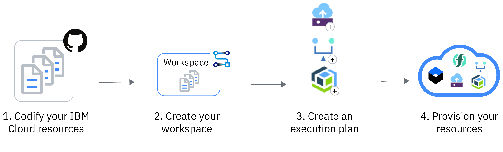

[Kubeflow](https://www.kubeflow.org/), an end-to-end Machine Learning(ML)
platform on Kubernetes, provides components and rich features to compose ML
pipelines. The new release, v1.3, just came out recently. You can try out the
new release by following the instructions here:
https://www.kubeflow.org/docs/distributions/ibm/ to deploy the new release on
IBM Kubernetes Service(IKS). However, the deployment involves Kubernetes cluster
creation, environment setup locally, deployment, configuration and etc. If you
are not familiar with these operations, they look intimidating. One mistake in
these procedures may lead to a painful debugging, reconfiguration and even
do-over from scratch. Don't worry, we have got your back. Here are the resources
to lower the barrier for you:

- Use [IBM Cloud Schematics](https://cloud.ibm.com/docs/schematics) to deploy
  multi-user Kubeflow v1.3 which integrates with
  [AppID](https://cloud.ibm.com/apidocs/app-id/management) as login mechanism:
  https://github.com/yhwang/auto-kubeflow/

In this Git repository, it provides a convenient approach to deploy Kubeflow
v1.3 on IBM Cloud. It leverages IBM Cloud Schematics to do resource
provisioning, including Kubernetes cluster service and AppID. Then it finishes
the deployment and configuration with Ansible playbook. After clicking the
"Apply" button on the Schematics service, you just sit back and relax to wait
for the deployment to complete automatically. When the deployment task finishes,
a fully functional multi-user Kubeflow environment will be read for you.
Currently, you can find two different configurations for the Kubeflow
deployment:
- Classic: Run your cluster with native subnet and VLAN networking on classic
  infrastructure.
- VPC Gen 2: Create a fully customizable, software-defined virtual network with
  superior isolation using IBM Cloud VPC.

You can choose the proper one that fits your needs. The end results will be the
same. However, for VPC Gen 2, you gain more controls of IKS cluster in
networking, public gateways, access control lists, security groups and etc. You
can modify these configuration in
["VPC Infrastructure"](https://cloud.ibm.com/vpc-ext/overview) page on IBM
Cloud.

IBM Cloud Schematics enables Infrastructure as Code(IaC) by using a high level
scripting language to model and manage the resources on IBM Cloud. Furthermore
Combining with Ansible helps you to provision use cases, configuration and
deploy applications. In this case, Ansible is used to deploy multi-user
Kubeflow, set up configuration and integrate with AppID. As for AppID, it
secures the Kubeflow and add authentication without changing application. The
authentication supports public social profiles and email sign up. You can also
further customize the login by yourself if needed. From IBM Cloud Schematics
workplace, you can find the links to all of the resources that are created for
the Kubeflow deployment, including IBM Kubernetes Service cluster, AppID and
Gateway for VPC Gen 2. Follow the links there, you can find the resources and
modify configurations for each resource. Using the "Destroy" action in IBM
Schematics, all of the related resources would be freed up by one single click.

You can also check out the tutorial in the repository here:
https://github.com/yhwang/auto-kubeflow/blob/main/tutorials/deploy_ibm_cloud.md.
It will guide you through the deployment process. Hopefully, you would be able
to have a Kubeflow cluster up and running with just a few clicks. Both classic
and VPC Gen 2 approaches give you the same Kubeflow configuration but different
underlying IKS infrastructure. For the Kubeflow perspective, the functionality
is the same. After you finish the deployment and access the public endpoint, you
will be redirected to AppID authentication page to sign in with your social
profiles or sign up with your email. When you complete the authentication, you
will see Kubeflow dashboard and be able to try out the ML pipeline experiments.
The provisioned Kubeflow is using
[Kubeflow Pipeline with Tekton](https://github.com/kubeflow/kfp-tekton). You can
find useful pipeline samples
[here](https://github.com/kubeflow/kfp-tekton/tree/master/samples). From there,
you can learn how to compose your ML pipeline by using Kubeflow domain specific
language(DSL) in python. Then upload and run your ML pipeline on Kubeflow
Dashboard.

If you are interested in DevOps,
[IBM DevOps Toolchain](https://cloud.ibm.com/docs/ContinuousDelivery) allows
you to integrate IBM Cloud Schematics into your continuous delivery pipeline.
From IBM Cloud Schematics workspace, you can find the
"Enable continuous delivery" option in the "Settings" page. By clicking the
link, you can create a DevOps Toolchain which uses the Schematics to provision
Kubeflow as one of the operation in the continuous delivery pipeline. You can
get more detailed information from this repository:
https://github.com/open-toolchain/schematics-toolchain.

Hope you can benefit by using IBM Cloud Schematics templates in this repo:
https://github.com/yhwang/auto-kubeflow/ to provision multi-user
Kubeflow deployment. If you have any question, feel free to open an issue there.
We, as IBM Developer Advocates, are very happy to provide comments, suggestions,
fix your problems or even add more features you need.